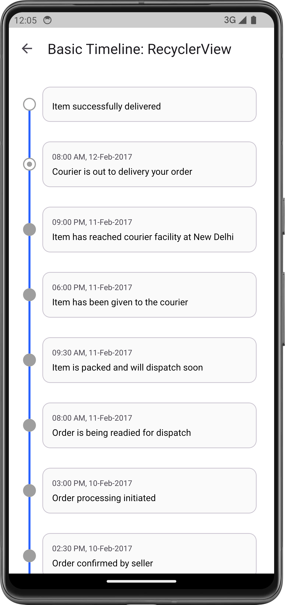

[](https://search.maven.org/search?q=g:%22com.github.vipulasri%22%20AND%20a:%22timelineview%22) [](https://androidweekly.net/issues/issue-395) [](https://www.appbrain.com/stats/libraries/details/timeline_view/timeline-view)
[](http://android-arsenal.com/details/1/2923)

# Timeline-View

Timeline View is a powerful library for creating visually appealing timeline-based UIs. It is perfect for use cases such as shipment/order tracking, step progress indicators, etc.

|                        `Vertical`                         |                        `Horizontal`                         |                        `Dashed`                         |
|:---------------------------------------------------------:|:-----------------------------------------------------------:|:-------------------------------------------------------:|
|  |  |  |

## Quick Start

[](https://search.maven.org/search?q=g:%22com.github.vipulasri%22%20AND%20a:%22timelineview%22)

Add the dependency to your app's build.gradle:

#### Android View
```gradle
dependencies {
    implementation("com.github.vipulasri:timelineview:${latest_version}")
}
```

#### Jetpack Compose
```gradle
dependencies {
    implementation("com.github.vipulasri:timelineview-compose:${latest_version}")
}
```

## Documentation

For comprehensive information about Timeline View, please look at the **[official documentation](https://vipulasri.github.io/Timeline-View)**.
<br>
<br>
### Who's using Timeline View?

[Apps using Timeline-View, via AppBrain Stats](https://www.appbrain.com/stats/libraries/details/timeline_view/timeline-view)

If you're using this library in your app and you'd like to list it here,
Please let me know via [email](mailto:me@vipulasri.com), [pull requests](https://github.com/vipulasri/Timeline-View/pulls) or [issues](https://github.com/vipulasri/Timeline-View/issues).

## License


    Copyright 2015-2025 Vipul Asri

    Licensed under the Apache License, Version 2.0 (the "License");
    you may not use this file except in compliance with the License.
    You may obtain a copy of the License at

       http://www.apache.org/licenses/LICENSE-2.0

    Unless required by applicable law or agreed to in writing, software
    distributed under the License is distributed on an "AS IS" BASIS,
    WITHOUT WARRANTIES OR CONDITIONS OF ANY KIND, either express or implied.
    See the License for the specific language governing permissions and
    limitations under the License.
