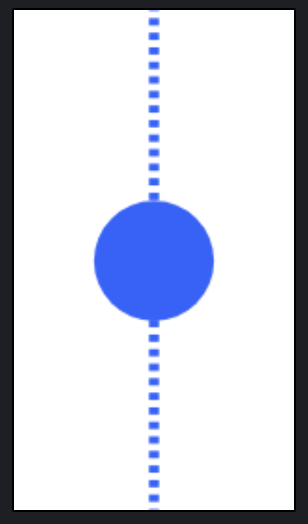

# Timeline usage in Compose

### Simple
```kotlin
Timeline(
    modifier = Modifier.height(100.dp),
    lineType = LineType.MIDDLE,
    lineStyle = LineStyle.dashed(
        color = MaterialTheme.colorScheme.primary,
        width = 2.dp
    ),
    marker = {
        Box(
            modifier = Modifier
                .size(24.dp)
                .background(
                    color = MaterialTheme.colorScheme.primary,
                    CircleShape
                )
        )
    }
)
```
Output

{ width="100" }

### With Content

```kotlin
Row(
    modifier = Modifier.height(IntrinsicSize.Min)
        .padding(start = 16.dp),
    verticalAlignment = Alignment.CenterVertically
) {
    Timeline(
        modifier = Modifier.fillMaxHeight(),
        lineType = LineType.MIDDLE,
        lineStyle = LineStyle.solid(
            color = MaterialTheme.colorScheme.primary,
            width = 2.dp
        ),
        marker = {
            Icon(
                imageVector = Icons.Default.Check,
                contentDescription = null,
                modifier = Modifier
                    .size(24.dp)
                    .background(
                        color = MaterialTheme.colorScheme.primary,
                        shape = CircleShape
                    )
                    .padding(4.dp),
                tint = Color.White
            )
        }
    )

    Card(
        Modifier.padding(16.dp).weight(1f)
    ) {
        Column(
            modifier = Modifier.padding(16.dp)
        ) {
            Text(
                text = "Order Placed",
                style = MaterialTheme.typography.titleMedium
            )
            Text(
                text = "Your order has been placed",
                style = MaterialTheme.typography.bodyMedium
            )
        }
    }
}
```

Output

{ width="500" }

### LazyColumn

```kotlin
LazyColumn {
    items(timelineItems.size) { index ->
        Row(
            modifier = Modifier.padding(16.dp),
            verticalAlignment = Alignment.CenterVertically
        ) {
            Timeline(
                lineType = getLineType(index, timelineItems.size),
                lineStyle = LineStyle.dashed(
                    color = MaterialTheme.colorScheme.primary,
                    width = 2.dp,
                    dashLength = 8.dp,
                    dashGap = 4.dp
                ),
                marker = {
                    // Your marker composable
                }
            )
            
            // Your content composable
        }
    }
}
```

Output

{ width="500" }

### Custom Markers with Inconsistent Size

```kotlin
Column(Modifier.padding(horizontal = 16.dp)) {
    val totalItems = 4
    repeat(totalItems) { position ->

        var modifier = Modifier
            .height(100.dp)

        if (position != 1) {
            modifier = modifier.then(Modifier.padding(horizontal = 13.dp))
        }

        Timeline(
            modifier = modifier,
            lineType = getLineType(position, totalItems),
            lineStyle = when (position) {
                0 -> {
                    LineStyle.dashed(
                        color = Color.Gray,
                        width = 3.dp
                    )
                }

                1 -> {
                    LineStyle(
                        startLine = DashedLine(
                            color = Color.Gray,
                            width = 3.dp
                        ),
                        endLine = SolidLine(
                            color = MaterialTheme.colorScheme.primary,
                            width = 3.dp
                        ),
                    )
                }

                else -> {
                    LineStyle.solid(
                        color = MaterialTheme.colorScheme.primary,
                        width = 3.dp
                    )
                }
            }
        ) {
            // Custom marker examples
            when (position) {
                0 -> Icon(
                    imageVector = Icons.Default.Star,
                    contentDescription = null,
                    tint = MaterialTheme.colorScheme.primary,
                    modifier = Modifier.size(24.dp)
                )

                1 -> Box(
                    modifier = Modifier
                        .size(50.dp)
                        .background(
                            MaterialTheme.colorScheme.primary,
                            RoundedCornerShape(4.dp)
                        )
                )

                2 -> Box(
                    Modifier
                        .size(24.dp)
                        .background(MaterialTheme.colorScheme.primary, CircleShape)
                ) {
                    Text(
                        modifier = Modifier.align(Alignment.Center),
                        text = "3",
                        color = Color.White,
                        textAlign = TextAlign.Center
                    )
                }

                else -> {
                    Box(
                        modifier = Modifier
                            .size(24.dp)
                            .background(MaterialTheme.colorScheme.primary, CircleShape)
                    )
                }
            }
        }
    }
}
```

Output

{ width="100" }